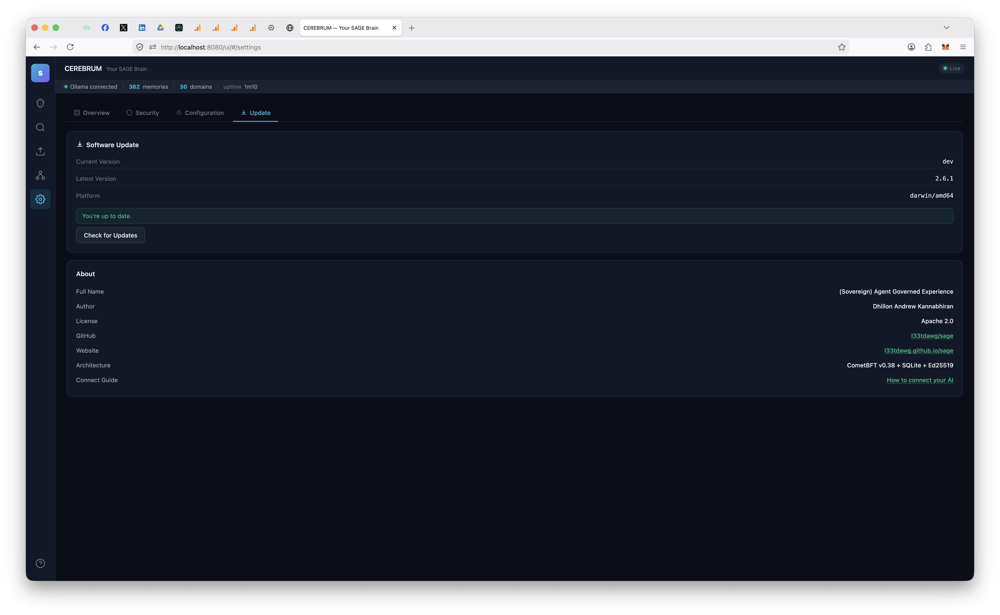

# (S)AGE — Sovereign Agent Governed Experience

**Persistent, consensus-validated memory infrastructure for AI agents.**

SAGE gives AI agents institutional memory that persists across conversations, goes through BFT consensus validation, carries confidence scores, and decays naturally over time. Not a flat file. Not a vector DB bolted onto a chat app. Infrastructure — built on the same consensus primitives as distributed ledgers.

The architecture is described in [Paper 1: Agent Memory Infrastructure](papers/Paper1%20-%20Agent%20Memory%20Infrastructure%20-%20Byzantine-Resilient%20Institutional%20Memory%20for%20Multi-Agent%20Systems.pdf).

> **Just want to install it?** [Download here](https://l33tdawg.github.io/sage/) — double-click, done. Works with any AI.

<a href="https://glama.ai/mcp/servers/l33tdawg/s-age">
  
</a>

---

## Architecture

```
Agent (Claude, ChatGPT, DeepSeek, Gemini, etc.)
  │ MCP / REST
  ▼
sage-gui
  ├── ABCI App (validation, confidence, decay, Ed25519 sigs)
  ├── App Validators (sentinel, dedup, quality, consistency — BFT 3/4 quorum)
  ├── Governance Engine (on-chain validator proposals + voting)
  ├── CometBFT consensus (single-validator or multi-agent network)
  ├── SQLite + optional AES-256-GCM encryption
  ├── CEREBRUM Dashboard (SPA, real-time SSE)
  └── Network Agent Manager (add/remove agents, key rotation, LAN pairing)
```

Personal mode runs a real CometBFT node with 4 in-process application validators — every memory write goes through pre-validation, signed vote transactions, and BFT quorum before committing. Same consensus pipeline as multi-node deployments. Add more agents from the dashboard when you're ready.

Full deployment guide (multi-agent networks, RBAC, federation, monitoring): **[Architecture docs](docs/ARCHITECTURE.md)**

---

## CEREBRUM Dashboard


`http://localhost:8080/ui/` — force-directed neural graph, domain filtering, semantic search, real-time updates via SSE.

### Network Management


Add agents, configure domain-level read/write permissions, manage clearance levels, rotate keys, download bundles — all from the dashboard.

### Settings

| Overview | Security | Configuration | Update |
|:---:|:---:|:---:|:---:|
|  |  |  |  |
| Chain health, peers, system status | Synaptic Ledger encryption, export | Boot instructions, cleanup, tooltips | One-click updates from dashboard |

---

## What's New in v8.4

Real Domain factor — the **last Phase-1 stub closed**. After v8.3 made accuracy and corroboration real, the Domain term (D, 30% of the PoE weight) was still a flat `0.5` constant, so a validator's *subject-matter expertise* counted for nothing. v8.4 makes it real behind a single fork (`app-v5`): a validator's vote on a memory in domain `D` is now weighted by its demonstrated verdict-correctness **in `D`**. Pre-fork blocks (and any v8.3.x chain) replay byte-identical to v8.3.0.

- **Domain-conditional quorum weight.** When a non-shared-domain memory is voted on, `checkAndApplyQuorum` weights each validator by `ComputeWeight(globalAccuracy, domainAccuracy(v,D), recency, corroboration)` — the domain term read live from a per-domain verdict-correctness EWMA, the global terms recomputed live from `vstats:<v>`. A proven `pwn_heap` expert out-weighs a generalist on `pwn_heap` memories, but not on `crypto` ones. Experts genuinely carry more weight (raw `ComputeWeight`, not the epoch-normalized scalar, since the RepCap collapses small validator sets to equal and would erase the signal).
- **Keyed per-domain stats — no positional-vector determinism trap.** Per-domain expertise lives at `vstats_domain:<validatorID>:<domain>`, reusing v8.3's exact 24/56-byte codec, rather than a positional `[]float64` indexed by a growing domain registry (which would make the tag→index ordering a consensus-split hazard). The memory's domain is recorded at submit in `memdomain:<id>` (the on-chain `memory:<id>` record only stores contentHash+status). Shared catch-alls (`general`, `self`) and unknown/legacy memories fall back to the v8.2 scalar weight.
- **Consensus-drift hardening (from a 73-agent adversarial audit of v8.3+v8.4).** Folded into the same fork: epoch-weight normalization now sums in **sorted-key order** (`NormalizeWeightsDeterministic`) — the legacy map-iteration sum was non-associative and could split the AppHash across replicas with ≥3 distinct-magnitude weights (a latent issue since v8.2, masked by equal-weight devnets). Also: re-submitting a memoryID that already reached a terminal verdict is now rejected (it previously rewound to `proposed` and let a fresh vote double-credit the verdict EWMA — a reputation-gaming vector); verdict crediting is gated on the on-chain status write succeeding; and the PoE fork gates are reconciled monotonic so a version jump can't activate a higher fork while a lower one stays off. Every fix is fork-gated or no-ops on existing chains (byte-identical replay).
- **Test coverage.** Store DS1-DS4 (per-domain codec/round-trip/independence/atomicity, `memdomain` get/set). Quorum DQ1-DQ7 (expert dissent flips a verdict; same votes → opposite outcome by domain; shared/unknown fall back; per-domain crediting + replay idempotency). An end-to-end test drives a real `app-v5` activation, asserting `memdomain:`/`vstats_domain:` appear only post-fork. Plus determinism (200× bit-identical `NormalizeWeightsDeterministic`), re-submit-guard (both fork sides), and monotonic-reconcile regressions. Full suite green; lint clean.

## Older releases

<details>
<summary>v8.3 — real PoE signals (verdict-correctness EWMA + corroboration)</summary>

- **v8.3 — accuracy & corroboration made real.** v8.2 made quorum *consult* PoE weights, but accuracy was still a cold-start accept-ratio blend (rewarding voting "accept", not being *right*) and corroboration a hardcoded default. v8.3 closed both behind one fork (`app-v4`): `accuracy` became the verdict-correctness EWMA (`poe.EWMATracker`, η=0.9 — did the vote match the final committed/deprecated verdict), `corr_score` the lifetime verdict-match `CorrCount`. Both credited once on the first proposed→terminal transition (prior status captured before any `SetMemoryHash`), persisted in `vstats:<id>` records grown 24→56 bytes with a lazy per-validator migration + length-dispatch decode. Off-chain `/v1/agent` accuracy re-sourced from the same EWMA. Pre-fork byte-identical to v8.2.1; an end-to-end test held pre-fork 0.65/0-corr vs post-fork 0.70/0.53 for consensus-aligned validators and 0.30 for a dissenter. SDK 8.3.0.

</details>

<details>
<summary>v8.2 — PoE-weighted quorum activation</summary>

- **v8.2 — PoE weights drive quorum.** The PoE engine had computed per-validator engagement scores every epoch since v6.x, but `checkAndApplyQuorum` ignored them and used a hardcoded `weights[v.ID] = 1.0` — quorum was a 2/3 *majority*, not a 2/3 *weighted vote*. v8.2 closed that with a single fork-gated swap (`app-v3`): post-fork quorum consults `v.PoEWeight` via `app.postV8_2Fork(height)`; the normalized weight set is persisted on-chain every epoch (`poew:current` + `poew:<id>`, pruned on governance set changes, rehydrated on restart); `poeWeightOrFallback` returns `1/N` for pre-first-epoch / mid-epoch-add / missing-entry cases, keeping the fallback in `NormalizeWeights`' numeric range without moving the ratio-only 2/3 threshold. Bundled CometBFT v0.38.15 → v0.38.23 (GHSA-hrhf-2vcr-ghch + blocksync/nil-vote/ABCI-socket hardening). Pre-fork byte-identical to v8.1.2; 16 new tests + a 4-validator devnet held byte-identical AppHash for 160+ blocks across two epoch boundaries.

</details>

<details>
<summary>Capability milestones across v3–v7 (full per-patch detail on the <a href="https://github.com/l33tdawg/sage/releases">Releases page</a>)</summary>

- **v8.1 — Governance + ancestor cleanup + O(1) per-block AppHash.** Three follow-up fixes after v8.0 surfaced edges: postgres quorum register-agent consensus halt (8.0.1), postgres quorum governance mirror (8.1.0), per-record clearance arg on SDK `propose()` (8.1.1), governance/ancestor walk cleanups + `ComputeAppHash` switched from `O(state)` per-block alloc to streaming SHA-256 over a lex-sorted iterator (8.1.2). Single-machine personal mode no longer churns GC pressure linearly with chain height.
- **v8.0 — Access-control consensus cleanup.** Three real bugs from v7.1 fixed behind a single fork (`app-v2`): subdomain grants now cascade via `HasAccessOrAncestor`, granting on an unowned domain auto-claims it, and `TxTypeDomainReassign` recovers lost-owner domains via a 3/4-supermajority gov proposal. Pre-fork byte-identical to v7.1.1. Python SDK 8.0.0 adds `submit_domain_reassign` + a high-level `reassign_domain` helper.
- **v7.7 — Agent profile fill-in.** `GET /v1/agent/me` now returns the full profile the OpenAPI schema promised — `display_name`, `domains`, `accuracy`, `on_chain_height` — so SDK consumers don't round-trip to `/v1/agent/{id}` plus the validator-score endpoint just to render a profile card.
- **v7.6 — Direct-write hooks for Claude Code and Codex.** `sage-gui hook session-start | session-end` signs REST calls to the local SAGE node directly; `mcp install` and `codex install` ship the unified 5-script lifecycle set; selfHeal migrates legacy installs and auto-installs hooks on MCP boot for pre-v7.6 projects (v7.6.2).
- **v7.5 — Migration substrate.** Hands-off in-place chain upgrades — scheduled snapshots with verify-by-restore, upgrade tx types with chain-computed activation height, auto-proposal watchdog, HALT sentinel + supervised rollback. v7.5.0 itself ships zero consensus-rule changes; it's the plumbing every later release rides on.
- **v7.1 — Recall quality + second benchmark.** Optional cross-encoder reranking and query expansion on `/v1/memory/hybrid`, LoCoMo benchmark (R@5=0.6394 stock), SAGE adapter shipped upstream to mem0's open-source evaluator. v7.1.1 closed the silent ghost-tx surface on RBAC/governance writes.
- **v7.0 — Hybrid recall + ambient capture.** BM25 + vector fused via Reciprocal Rank Fusion on a new `/v1/memory/hybrid` endpoint, direct-write lifecycle hooks for Claude Code, branch-aware memory tagging, LongMemEval-S benchmark at R@5=0.9053.
- **v6.8 — Hardening pass.** OAuth Dynamic Client Registration + persistent client metadata, mandatory `state` + HMAC-signed CSRF on `/oauth/authorize`, strict same-origin on CEREBRUM wizard endpoints, locked-down subprocess test seams. Admin-bootstrap escape hatch (6.8.5), cross-agent visibility hotfix (6.8.4), Windows wizard parity (6.8.1).
- **v6.7 — ChatGPT MCP connector.** OAuth 2.0 + PKCE wrapper, RFC 8414/7591/9728 discovery and Dynamic Client Registration, in-dashboard ChatGPT setup wizard (6.7.3, Cloudflare zone dropdown 6.7.4), HTTPS-capable HTTP MCP transport (`/v1/mcp/sse` + `/v1/mcp/streamable` on `:8443`) with bearer tokens.
- **v6.6 — Tags + multi-org + RBAC fixes.** Tags first-class on `/v1/memory/submit` and `/query`/`/search` filtering. Multi-org membership reverse index so agents in N orgs no longer silently lose access to N-1 of them. `PUT /v1/agent/{id}/permission` no longer silent-no-ops for non-admin self/org-admin callers. SQLITE_BUSY silent-drop fix at source (WAL pragma + writeMu-guarded BeginTx). Encrypted CA key in quorum manifest (Argon2id + AES-256-GCM envelope).
- **v6.5 — TLS everywhere.** Per-quorum ECDSA P-256 CA, dual-listener REST API (TLS `:8443` + local HTTP `:8080`), Python SDK `ca_cert` parameter. Stuck-proposed deprecation when quorum unreachable. RBAC ownership-theft fix + real broadcast errors surfaced to clients.
- **v6.0 — Dynamic validator governance.** Add/remove/repower validators without stopping the chain via on-chain governance proposals (2/3 BFT quorum). New `internal/governance/` package, in-dashboard Governance section.
- **v5.x — Consensus-first writes + FTS5.** All submissions go through BFT consensus before they surface in queries. 4-validator Docker cluster with fault injection in CI. FTS5 keyword search fallback. Nonce-based replay protection. Python SDK.
- **v4.x — App validators + RBAC + Synaptic Ledger.** Sentinel / Dedup / Quality / Consistency validators with 3/4 quorum. Agent isolation, domain-level permissions, clearance levels, multi-org federation. AES-256-GCM encryption with Argon2id key derivation.
- **v3.x — Multi-agent networks.** Add agents from dashboard, LAN pairing, key rotation, redeployment orchestrator. On-chain agent identity via CometBFT consensus. CEREBRUM dashboard.

</details>

---

## Research

| Paper | Key Result |
|-------|------------|
| [Agent Memory Infrastructure](papers/Paper1%20-%20Agent%20Memory%20Infrastructure%20-%20Byzantine-Resilient%20Institutional%20Memory%20for%20Multi-Agent%20Systems.pdf) | BFT consensus architecture for agent memory |
| [Consensus-Validated Memory](papers/Paper2%20-%20Consensus-Validated%20Memory%20Improves%20Agent%20Performance%20on%20Complex%20Tasks.pdf) | 50-vs-50 study: memory agents outperform memoryless |
| [Institutional Memory](papers/Paper3%20-%20Institutional%20Memory%20as%20Organizational%20Knowledge%20-%20AI%20Agents%20That%20Learn%20Their%20Jobs%20from%20Experience%20Not%20Instructions.pdf) | Agents learn from experience, not instructions |
| [Longitudinal Learning](papers/Paper4%20-%20Longitudinal%20Learning%20in%20Governed%20Multi-Agent%20Systems%20-%20How%20Institutional%20Memory%20Improves%20Agent%20Performance%20Over%20Time.pdf) | Cumulative learning: rho=0.716 with memory vs 0.040 without |

---

## Quick Start

```bash
git clone https://github.com/l33tdawg/sage.git && cd sage
go build -o sage-gui ./cmd/sage-gui/
./sage-gui setup    # Pick your AI, get MCP config
./sage-gui serve    # SAGE + Dashboard on :8080
```

Or grab a binary: [macOS DMG](https://github.com/l33tdawg/sage/releases/latest) (signed & notarized) | [Windows EXE](https://github.com/l33tdawg/sage/releases/latest) | [Linux tar.gz](https://github.com/l33tdawg/sage/releases/latest)

### Docker

```bash
docker pull ghcr.io/l33tdawg/sage:latest
docker run -p 8080:8080 -v ~/.sage:/root/.sage ghcr.io/l33tdawg/sage:latest
```

Pin a specific version with `ghcr.io/l33tdawg/sage:6.0.0`.

### Upgrading from an older version?

If you installed SAGE before v5.0 and your AI isn't doing turn-by-turn memory updates, re-run the installer in your project directory:

```bash
cd /path/to/your/project
sage-gui mcp install
```

This installs Claude Code hooks that enforce the memory lifecycle (boot, turn, reflect) — even if your `.mcp.json` is already configured. Restart your Claude Code session after running this.

---

## Documentation

| Doc | What's in it |
|-----|-------------|
| [Architecture & Deployment](docs/ARCHITECTURE.md) | Multi-agent networks, BFT, RBAC, federation, API reference |
| [Getting Started](docs/GETTING_STARTED.md) | Setup walkthrough, embedding providers, multi-agent network guide |
| [Security FAQ](SECURITY_FAQ.md) | Threat model, encryption, auth, signature scheme |
| [Connect Your AI](https://l33tdawg.github.io/sage/connect.html) | Interactive setup wizard for any provider |

---

## Stack

Go / CometBFT v0.38 / chi / SQLite / Ed25519 + AES-256-GCM + Argon2id / MCP

---

## License

Code: [Apache 2.0](LICENSE) | Papers: [CC BY 4.0](https://creativecommons.org/licenses/by/4.0/)

## Author

Dhillon Andrew Kannabhiran ([@l33tdawg](https://github.com/l33tdawg))

---

<p align="center"><em>A tribute to <a href="http://phenoelit.darklab.org/fx.html">Felix 'FX' Lindner</a> — who showed us <b>how much further curiosity can go.</b></em></p>
