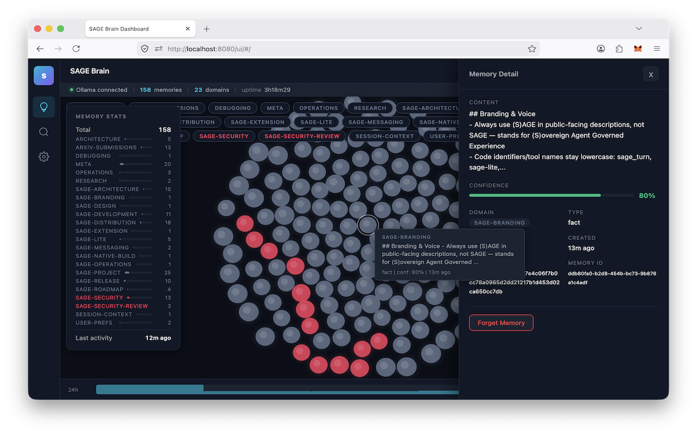

# (S)AGE — Sovereign Agent Governed Experience

**Persistent, consensus-validated memory infrastructure for AI agents.**

SAGE gives AI agents institutional memory that persists across conversations, goes through BFT consensus validation, carries confidence scores, and decays naturally over time. Not a flat file. Not a vector DB bolted onto a chat app. Infrastructure — built on the same consensus primitives as distributed ledgers.

The architecture is described in [Paper 1: Agent Memory Infrastructure](papers/Paper1%20-%20Agent%20Memory%20Infrastructure%20-%20Byzantine-Resilient%20Institutional%20Memory%20for%20Multi-Agent%20Systems.pdf).

> **Just want to install it?** [Download here](https://l33tdawg.github.io/sage/) — double-click, done. Works with any AI.

---

## Architecture

```
Agent (Claude, ChatGPT, DeepSeek, Gemini, etc.)
  │ MCP / REST
  ▼
sage-lite
  ├── ABCI App (validation, confidence, decay, Ed25519 sigs)
  ├── CometBFT consensus (single-validator personal mode)
  ├── SQLite + optional AES-256-GCM encryption
  └── Brain Dashboard (SPA, real-time SSE)
```

Personal mode runs a real single-validator CometBFT node — every memory write goes through the same `DeliverTx → Commit` pipeline as the full multi-node deployment.

Full deployment guide (4+ validators, RBAC, federation, monitoring): **[Architecture docs](docs/ARCHITECTURE.md)**

---

## Brain Dashboard



`http://localhost:8080/ui/` — force-directed neural graph, semantic search, timeline, real-time updates. [Details](docs/ARCHITECTURE.md)

---

## Research

| Paper | Key Result |
|-------|------------|
| [Agent Memory Infrastructure](papers/Paper1%20-%20Agent%20Memory%20Infrastructure%20-%20Byzantine-Resilient%20Institutional%20Memory%20for%20Multi-Agent%20Systems.pdf) | BFT consensus architecture for agent memory |
| [Consensus-Validated Memory](papers/Paper2%20-%20Consensus-Validated%20Memory%20Improves%20Agent%20Performance%20on%20Complex%20Tasks.pdf) | 50-vs-50 study: memory agents outperform memoryless |
| [Institutional Memory](papers/Paper3%20-%20Institutional%20Memory%20as%20Organizational%20Knowledge%20-%20AI%20Agents%20That%20Learn%20Their%20Jobs%20from%20Experience%20Not%20Instructions.pdf) | Agents learn from experience, not instructions |
| [Longitudinal Learning](papers/Paper4%20-%20Longitudinal%20Learning%20in%20Governed%20Multi-Agent%20Systems%20-%20How%20Institutional%20Memory%20Improves%20Agent%20Performance%20Over%20Time.pdf) | Cumulative learning: rho=0.716 with memory vs 0.040 without |

---

## Quick Start

```bash
git clone https://github.com/l33tdawg/sage.git && cd sage
go build -o sage-lite ./cmd/sage-lite/
./sage-lite setup    # Pick your AI, get MCP config
./sage-lite serve    # SAGE + Dashboard on :8080
```

Or grab a binary: [macOS DMG](https://github.com/l33tdawg/sage/releases/latest) (signed & notarized) | [Windows EXE](https://github.com/l33tdawg/sage/releases/latest) | [Linux tar.gz](https://github.com/l33tdawg/sage/releases/latest)

---

## Documentation

| Doc | What's in it |
|-----|-------------|
| [Architecture & Deployment](docs/ARCHITECTURE.md) | Multi-node BFT, RBAC, federation, API reference, monitoring |
| [Getting Started](docs/GETTING_STARTED.md) | Setup walkthrough, embedding providers, configuration |
| [Security FAQ](SECURITY_FAQ.md) | Threat model, encryption, auth, signature scheme |
| [Connect Your AI](https://l33tdawg.github.io/sage/connect.html) | Interactive setup wizard for any provider |

---

## Stack

Go / CometBFT / chi / SQLite (personal) / PostgreSQL (multi-node) / Ed25519 + AES-256-GCM + Argon2id / MCP

---

## License

Code: [Apache 2.0](LICENSE) | Papers: [CC BY 4.0](https://creativecommons.org/licenses/by/4.0/)

## Author

Dhillon Andrew Kannabhiran ([@l33tdawg](https://github.com/l33tdawg))

---

<p align="center"><em>A tribute to <a href="http://phenoelit.darklab.org/fx.html">Felix 'FX' Lindner</a> — who showed us <b>how much further curiosity can go.</b></em></p>
