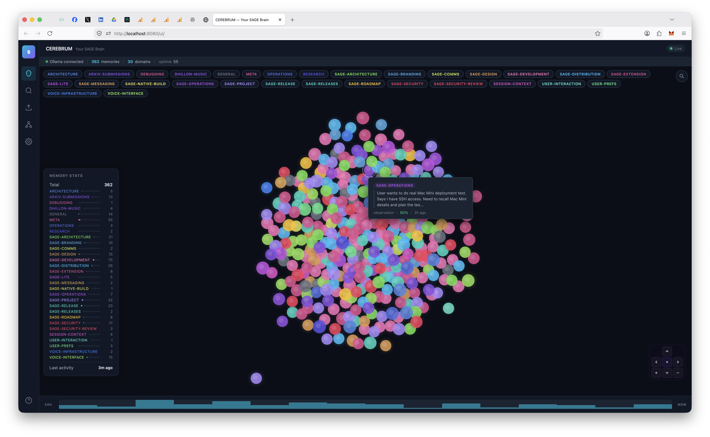
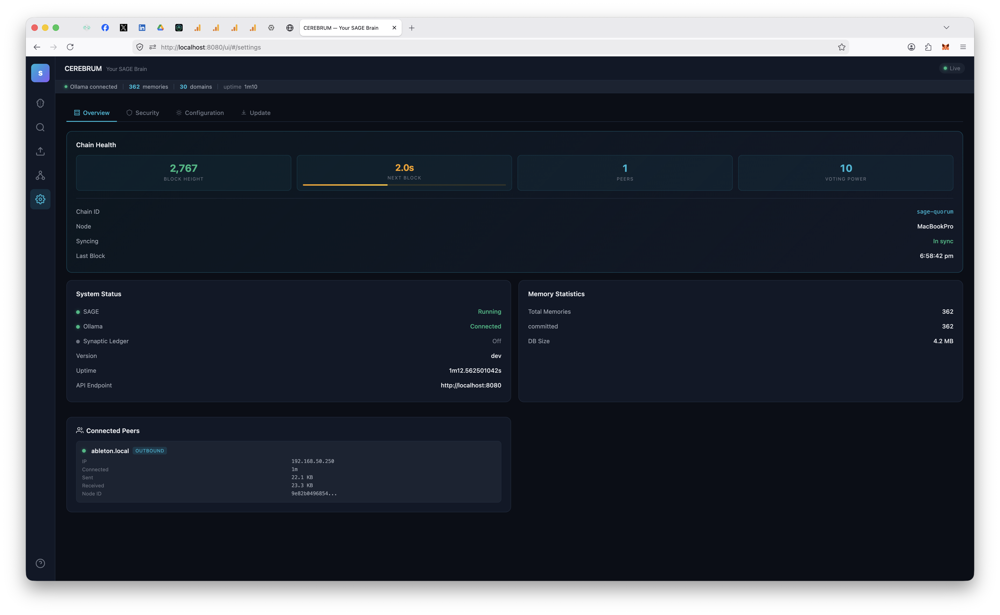
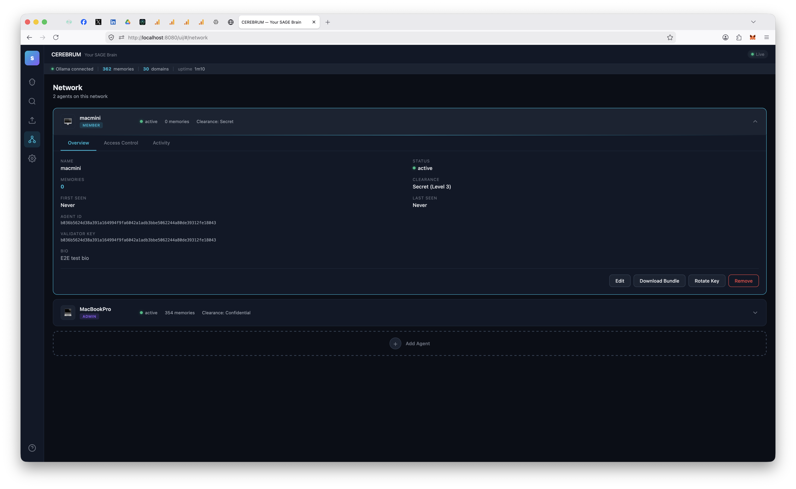
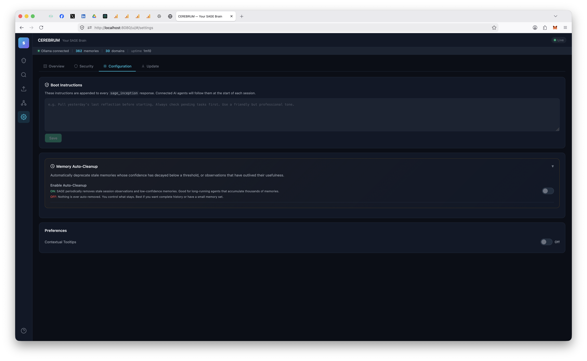

# (S)AGE — Sovereign Agent Governed Experience

**Persistent, consensus-validated memory infrastructure for AI agents.**

SAGE gives AI agents institutional memory that persists across conversations, goes through BFT consensus validation, carries confidence scores, and decays naturally over time. Not a flat file. Not a vector DB bolted onto a chat app. Infrastructure — built on the same consensus primitives as distributed ledgers.

The architecture is described in [Paper 1: Agent Memory Infrastructure](papers/Paper1%20-%20Agent%20Memory%20Infrastructure%20-%20Byzantine-Resilient%20Institutional%20Memory%20for%20Multi-Agent%20Systems.pdf).

> **Just want to install it?** [Download here](https://l33tdawg.github.io/sage/) — double-click, done. Works with any AI.

<a href="https://glama.ai/mcp/servers/l33tdawg/s-age">
  
</a>

---

## Architecture

```
Agent (Claude, ChatGPT, DeepSeek, Gemini, etc.)
  │ MCP / REST
  ▼
sage-gui
  ├── ABCI App (validation, confidence, decay, Ed25519 sigs)
  ├── Memory Auto-Voter (dedup, quality, consistency — one vote per node, signed with the node's consensus key)
  ├── Governance Engine (on-chain validator proposals + voting)
  ├── CometBFT consensus (single-validator or multi-agent network)
  ├── SQLite + optional AES-256-GCM encryption
  ├── CEREBRUM Dashboard (SPA, real-time SSE)
  └── Network Agent Manager (add/remove agents, key rotation, LAN pairing)
```

Personal mode runs a real CometBFT node with a per-node memory auto-voter — every memory write goes through pre-validation, a signed vote transaction, and the BFT quorum before committing. One node casts one vote; add more agents from the dashboard and each node votes with its own key, exactly the same consensus pipeline as a multi-node deployment.

Full deployment guide (multi-agent networks, RBAC, federation, monitoring): **[Architecture docs](docs/ARCHITECTURE.md)**

---

## CEREBRUM Dashboard



`http://localhost:8080/ui/` — a dashboard-native operator console centered on the 3D MRI memory brain, with chain health, agents, federation, semantic memory, recall tuning, vault recovery, tasks, imports, and updates around it. Every major workflow is available from the browser; the CLI stays there for automation and recovery.

| Control Board | Federation | Recall Engine |
|:---:|:---:|:---:|
|  |  |  |
| Chain health, quorum, agents, federation, and embeddings | Trust-only LAN or internet JOIN, followed by independent Read/Copy choices on each SAGE | Smart-memory setup, managed reranker install, and recall-depth tuning |

The dashboard also includes agent management, domain permissions, key rotation, import/export, software updates, and encryption controls.

---

## What's New in v11.9.1

**Task creation now applies the `[TASK]` marker exactly once.** MCP `sage_task` and CEREBRUM's task-creation path preserve content that is already marked instead of storing `[TASK] [TASK] ...`; unmarked content still receives the canonical prefix. Direct regression tests cover both entry points and both marked/unmarked inputs.

- **Safer release recovery.** A failed publication can be resumed only from the current protected `main` workflow and always checks out the exact immutable tag. The staged Python wheel smoke test installs declared runtime dependencies before importing the SDK, catching packaging metadata failures before any public channel is touched.
- **Stronger real-network evidence.** The four-validator partition proof accepts observed reject activity on either symmetric firewall endpoint while still verifying the exact peer topology on every node before, during, and after healing. This removes a timing-sensitive false failure without weakening the partition assertion.
- **Maintained build and storage stack.** The Go database, compression, TOML, and SQLite dependencies are refreshed through the full race and fault matrix. GitHub's Go, Node, and CodeQL actions are updated and remain pinned to immutable commits.

This patch changes no SAGE consensus rule, AppHash input, transaction type, key encoding, fork target, or application version. App-v20 and the v11.9 rollout boundary are unchanged; existing chains upgrade in place. SDK 11.9.1.

## Older releases

<details>
<summary>v11.9.0 - scoped consensus and colleague-style federation</summary>

> **Release evidence:** the exact-source `make v119-state-sync` cold run passed on source identity `7080580b15e7e5158a04e8b294ab772e51f294633be2737f904276afec4c3458`. The branch and tag workflows independently rerun the complete race, lint, SDK/frontend, security, fault, packaging, and publication gates before exposing release artifacts.

> **Validator rollout boundary:** install and restart the exact frozen v11.9 artifact on **every participating validator** before anyone broadcasts the non-empty-domain `app-v20` / target-20 ceremony transaction. A merely >2/3 upgraded subset is unsafe: v11.8 does not understand the signed governance-domain tail. For operator-managed socket-mode Comet, keep `recheck=true`, cap `max_tx_bytes` at 1 MiB, and restart Comet as well so no pre-rollout oversized mempool entry survives.

**Selected domains can now become canonical, recoverable quorum state inside one SAGE consensus chain.** App-v20 adds exact-domain scopes whose on-chain roster and integer weights are fixed by validator governance. Each scoped memory pins its submission-time denominator, so later membership changes cannot rewrite an in-flight ballot; acceptance requires strictly greater than two-thirds of that pinned weight. Scope membership grants voting weight only—it does not grant domain ownership, RBAC, federation access, or administrator authority.

- **Canonical recovery instead of projection trust.** Scoped content, classification, tags, roster revisions, and ballots are AppHash-covered in Badger. A recovering replica verifies the canonical envelopes and rebuilds its discarded SQLite/PostgreSQL serving projection; `/ready` stays unavailable when required scoped content is missing, locked, or inconsistent.
- **Authorized, boot-only network state sync.** Real ABCI state-sync endpoints serve a bounded latest-visible consensus stream, never the private local rollback bundle. A strict local authorization binds the chain, existing validator/provider IDs, joining node and validator key, app version, height floor, and expiry. The effective Comet profile disables peer discovery and ordinary peer capacity, enables authenticated exact-ID filtering, and requires two distinct reachable RPC origins for light-client verification. A synchronized receiver remains a non-validator until a separate signed governance action admits its validator key.
- **Crash-safe seal-before-serving.** A pristine receiver verifies the candidate in isolation, activates a complete application bundle under an exclusive lease, waits for Comet's signed commit/state/block-sync handoff, durably writes the sealed activation journal, durably disarms `quorum.state_sync.receiving`, cleans recovery evidence, and only then publishes the runtime seal. Projection rebuild, snapshots, REST/dashboard/MCP/federation, voters, and background workers start from that final frozen bundle.
- **Validator-bound governance sessions.** The configured operator signs the exact REST/MCP action, while the live validator still owns the outer transaction, proposal, vote, and voting power. App-v20 binds delegated governance proofs to the target validator and a chain-derived governance domain, with deterministic freshness and single-use replay protection.
- **Colleague-style sharing between independent SAGE brains.** A fresh JOIN establishes exact chain/operator/CA/epoch trust and starts with zero shared domains. Each peer independently selects existing domains and can change them without pairing again: Read borrows live recall, while Copy also requires the receiver's separate “Save here” opt-in. Cross-host Write remains an authenticated `501` until it has connection-bound consensus authorization. Direct and synchronization-group traffic revalidate the exact live identity, and agreement set, JOIN activation, narrowing, and revocation are linearized so a completed change cannot leave stale access in flight.
- **Crash-atomic app-v20 blocks.** The one authenticated app-v20 bootstrap is isolated into a dedicated block; after its marker commits, FinalizeBlock evaluates each complete block in one speculative Badger transaction. Commit atomically persists every ordinary/governance write, validator reconfiguration, nonce, AppHash, and handshake height. A pre-Commit crash discards the whole transition, so ordinary mixed blocks replay exactly without an app-local result journal or ongoing governance-only block isolation.
- **Release evidence spans real failures.** The gate suite combines signed app-v20 scope formation/revision in independent OS processes, FinalizeBlock/Commit SIGKILL replay, held-replica catch-up, real four-validator Comet TCP crash/partition/heal checks, and the integrated provider/observer/unauthorized/two-receiver state-sync topology. The final exact-tree cold execution passed before the release branch was published.

This is same-chain validator replication, not a relabeling of v11.8 synchronization groups or independent-chain federation. Internet validators still need mutually routable Comet TCP, explicit port forwarding, or an operator VPN, plus reachable RPC origins. Federation is not a validator tunnel; a future tunnel layer is separate work and is not part of v11.9.0.

App-v20 remains dormant until the governed upgrade activates it, preserving byte-identical pre-activation replay. A rolling binary install is safe only while the tagged target-20 ceremony has not been submitted. SDK 11.9.0.

</details>

<details>
<summary>v11.8.5 - anatomical MRI boundary</summary>

**MRI memories now remain inside the anatomical cranium at every zoom and rotation.** The memory cloud previously used a vertically symmetric ellipsoid even though the bundled anatomical mesh has a much shallower lower cranial boundary outside its narrow, off-centre brainstem. Lower-hemisphere nodes could therefore protrude through the mesh, especially after the v11.8.3 spread increase. CEREBRUM now uses an asymmetric vertical envelope with explicit clearance for each rendered sphere and bloom halo. The upper cortex keeps its full spread, and the newest-to-outer / oldest-to-inner age ordering is unchanged.

The placement contract is directly regression-tested across the full age, radial-jitter, and elevation range, including a fixed lower-cranium safety threshold. This patch changes no consensus rule, AppHash, transaction type, key encoding, fork, graph API limit, or server workload; existing chains replay byte-identically and app version 20 remains unallocated.

SDK 11.8.5.

</details>

<details>
<summary>v11.8.4 - actionable domain write denials</summary>

**Domain write denials now say what is wrong and how to fix it.** When consensus rejects a memory because its authenticated agent lacks level-2 write access to an owned domain, the REST API now returns a distinct, sanitized RFC 7807 `domain-write-denied` problem instead of collapsing it into a generic 403. MCP preserves that machine-readable type, immediately points the agent to CEREBRUM Access Controls or the domain owner, and performs no pointless re-registration, retry loop, or `/mcp` reconnect suggestion. Older servers' generic denial remains on the bounded compatibility recovery path.

The built-in CEREBRUM guide also explains SAGE's token-efficiency story without pretending every session necessarily uses fewer tokens: durable context lives outside any one model and only the relevant pieces are brought back, so token spend carries useful memory instead of repeated explanations and each tool rebuilding the same history.

This patch changes no consensus rule, AppHash, transaction type, key encoding, fork, or authorization decision; existing chains replay byte-identically and app version 20 remains unallocated.

SDK 11.8.4.

</details>

<details>
<summary>v11.8.3 - anatomical MRI memory spacing</summary>

**A memory brain that uses its full anatomy while keeping age meaningful.** CEREBRUM now spreads its 2,500-memory representative sample through a substantially broader portion of the MRI mesh instead of crowding long-lived histories into the centre. Fresh memories remain nearest the outer cortex; memories move progressively inward as they age, and the oldest cohort settles toward the lower inner brainstem. A one-year age window replaces the old 90-day clamp, while a small deterministic radial offset separates same-age memories without turning the stable layout into a force simulation.

The placement calculation now lives in a pure, directly tested module with bounded mesh extents and monotonic age-to-depth checks. This patch changes no consensus rule, AppHash, transaction type, key encoding, fork, graph API limit, or server workload; existing chains replay byte-identically and app version 20 remains unallocated.

SDK 11.8.3.

</details>

<details>
<summary>v11.8.2 - synchronization groups and a denser MRI</summary>

**Synchronization groups — human-verified, signed memory sharing between separate SAGE brains.** A synchronization group coordinates memory sharing off-consensus through a partitioned, hash-chained, ed25519-signed audit journal: a roster sub-chain replicated to every member and independent per-domain sub-chains replicated only to the members who share that domain, so a node never learns of a domain it does not share. Group items are origin-signed, so a relaying peer can back-fill the mesh without being able to forge or mis-attribute them. Adding a shared domain is a two-party action — the owning member and the group controller both sign — members express selective-sync consent over the subset of domains they receive, and controller epoch rotation, member removal, and rejoin are all explicit signed roster events reconciled between peers by anti-entropy exchange.

Each MCP bearer token now mints and registers its own signing identity, so a delegated agent action is attributable to exactly one token and one token can never act as another. This release also hardens group authorization: a controller epoch rotation now re-attests the shared domain set under the incoming controller, so rotating control away from a node revokes that node's ability to admit or re-widen shared domains with its old key; and a removed or departed member cannot be silently re-activated with stale entitlements — re-entry requires a fresh, co-signed invitation. The v11.8 consensus fork gate is present but dormant.

The CEREBRUM MRI now renders a 2,500-memory representative sample instead of stopping at 500, filling large brains with a denser view while preserving a bounded GPU and API workload. The dashboard and fullscreen MRI share one limit, and operators can still tune the server ceiling with `SAGE_GRAPH_MAX_NODES`.

v11.8.2 is the first published build of the v11.8 line. It also clears the release lint gate and adds a replay-safety regression guard for the delegated-proof rules already committed by v11.7.6 and v11.7.7 chains. The recovery changes no production behavior beyond the reviewed v11.8 source tree apart from the denser MRI visualization.

SDK 11.8.2.

</details>

<details>
<summary>v11.7.7 - one CEREBRUM tab in Firefox</summary>

**One CEREBRUM tab in Firefox, including across app restarts.** v11.7.7 fixes the remaining macOS launch path that could create duplicate CEREBRUM tabs. The earlier tab-focus implementation could inspect Safari and Chromium-family tabs, but Firefox exposes no equivalent AppleScript tab API; the native app also incorrectly assumed a newly started tray process could not inherit a browser tab left open by the previous process. SAGE now checks a loopback-only live-dashboard presence signal before opening a URL and activates the default browser when CEREBRUM is already connected. Initial app launch, post-update restart, dock reopen, and the **Open CEREBRUM** menu all use the same reuse path.

This patch changes no consensus rule, AppHash, transaction type, key encoding, or fork; existing chains replay byte-identically.

SDK 11.7.7.

</details>

<details>
<summary>v11.7.6 - reliable MCP turns and complete task cards</summary>

**Reliable MCP turn writes and task cards that show the whole job.** v11.7.6 fixes two post-app-v17 delegated-proof failures that v11.7.4 exposed after making the node authoritative for embeddings. Consensus now keeps every agent-controlled memory field bound to the exact signed request while accepting the validator-signed node's derived embedding hash, so provider cutovers no longer turn valid `sage_turn` observations into opaque CheckTx rejections. Fresh requests also survive the first block after a long idle period even when deterministic chain time trails the already wall-clock-validated MCP request; captured old proofs remain rejected. Public REST/MCP errors now distinguish proof mismatch and expiry from a generic `request rejected`.

CEREBRUM task cards stay compact by default but can expand to show complete multiline text. Planned tasks can be edited and saved without rewriting consensus history: SAGE confirms a replacement task first, then retires the original card. Existing committed blocks replay byte-identically; this patch changes only admission of requests that older binaries incorrectly rejected.

SDK 11.7.6.

</details>

<details>
<summary>v11.7.5 - readable contextual help</summary>

**Readable contextual help at every CEREBRUM boundary.** Help tooltips now account for the nearest scroll-clipping container as well as the browser viewport, so hints near the top of Settings and other bounded panels flip downward instead of opening behind the fixed application chrome. The positioning check runs after the tooltip is rendered and keeps keyboard/focus behavior intact. This patch changes no consensus rule, AppHash, transaction type, key encoding, or fork; existing chains replay byte-identically.

SDK 11.7.5.

</details>

<details>
<summary>v11.7.4 - provider-safe Smart Memory and CEREBRUM launch</summary>

**Provider-safe Smart Memory, automatic repair, and one CEREBRUM tab.** The SAGE node is now authoritative for every stored vector: it regenerates agent submissions with the selected embedding provider, stamps the exact vector space, and filters vector recall to that same space. Switching between preferred Ollama embeddings and local hash embeddings cuts write/query authority over before background migration, so active agents cannot keep a migration alive forever and recall never compares incompatible vectors. Provider recovery is watched continuously, so vectorless observations left by a transient outage repair automatically after Ollama or another configured embedder returns. New MCP clients still attach a compatibility vector for older SAGE nodes, while v11.7.4 nodes safely regenerate it.

CEREBRUM Settings now presents Ollama/hash embeddings and the independent reranker On/Off control directly, and the top status strip shows reranker state. The macOS dock app focuses an existing localhost CEREBRUM tab before opening a new one, with bounded browser automation and a safe fallback. PostgreSQL mirrors the embedding-provider provenance used by personal SQLite nodes. This patch changes no consensus rule, AppHash, transaction type, key encoding, or fork; existing chains replay byte-identically.

SDK 11.7.4.

</details>

<details>
<summary>v11.7.3 - strict project memory, task ownership, and Settings efficiency</summary>

**Strict project memory and task ownership, plus a cooler Settings page.** `sage_turn` now treats its domain as an exact recall boundary, so one repository's session cannot be re-anchored by memories from another repository. Agent backlogs return only tasks whose assignee exactly matches the signature-verified agent ID; unassigned work stays in human CEREBRUM triage and cannot be self-claimed. Agent-created tasks are assigned to their creator, every `in_progress` task must have an owner, and historical ownerless running rows return to Planned on upgrade. Assignment also remains subject to the agent's domain-access policy.

CEREBRUM no longer polls health, full memory statistics, and the complete agent inventory every three seconds. Health refreshes at a calmer interval, the existing health payload supplies memory totals without a duplicate full-store scan, agents load only when Overview is visible, and all Settings polling pauses in background tabs. An RBAC save that fails on-chain now says clearly that access is not active and keeps Save enabled for an actual retry. This patch changes no consensus rule, AppHash, transaction type, key encoding, or fork; existing chains replay byte-identically.

SDK 11.7.3.

</details>

<details>
<summary>v11.7.2 - secure background updates and CEREBRUM fixes</summary>

**Background macOS updates are back, without compromising the signed app.** SAGE now downloads and installs directly from the update banner, verifies the architecture-specific DMG against its published SHA-256, mounts it read-only, enforces the expected bundle identifier and Developer ID team, and asks Gatekeeper to validate both the release app and its staged copy. Activation atomically exchanges the entire signed `SAGE.app` bundle while preserving the previous bundle for proof-of-boot rollback. CEREBRUM also restores Access Controls, fixes Task Board page scrolling, and isolates the live block countdown so it no longer re-renders the entire Settings screen. Existing chains replay byte-identically.

SDK 11.7.2.

</details>

<details>
<summary>v11.7.1 - smart-memory reliability and task-board maintenance</summary>

**Smart-memory reliability and task-board maintenance release.** Managed Smart Memory now stays managed: SAGE supervises the local Ollama runtime, adopts it across upgrades, and automatically restarts it after a crash instead of leaving semantic recall offline until manual repair. CEREBRUM tasks, imports, and pipeline journals now preserve embedding provenance, so newly indexed memories no longer drift back into the “needs fixing” queue after a successful repair. The task board also correctly fills the remaining application height, keeping the bottom of every column reachable. This patch changes no consensus rule, AppHash, transaction type, key encoding, or fork; existing chains replay byte-identically.

SDK 11.7.1.

</details>

<details>
<summary>v11.7.0 - administration, connection, and lifecycle</summary>

**Administration, connection, and lifecycle release.** The genesis admin can now give a locally installed agent read or read+write access to a domain another agent owns, directly from CEREBRUM: the original owner is shown before confirmation, bound into the consensus transaction, and the override is recorded as an ordinary on-chain grant/revoke. Consensus support ships behind the dormant `app-v18` gate; existing chains replay byte-identically. Connecting AI tools now follows OpenAI's current product surfaces: ChatGPT desktop's Codex mode gets a one-click app-wide local connection (shared with Codex CLI and the IDE extension), while ChatGPT Work uses the hosted connector path. Restarts and updates are coordinated end-to-end: a single-instance lock, clean draining of MCP sessions and dashboard streams, checksum-verified updates with automatic rollback and proof-of-boot verification. CEREBRUM now checks for new releases automatically and shows an update banner at the top of every page, with release notes and a direct path to update or restart options. This release also fixes the v11.6.1 reports of intermittent lost MCP connections and "cannot save to domain" errors (a boot-time key cache, transport blips mislabeled as permission denials, and a keep-alive race), hardens the HTTP MCP transport (operator-only bearer principal, nonce replay cache, exact origin allowlist), and rewrites the in-app CEREBRUM guide in plain language for non-technical users.

SDK 11.7.0.

</details>

<details>
<summary>v11.6.1 - security + task-handoff maintenance</summary>

**Security and task-handoff maintenance release.** v11.6.1 upgrades the transitive federation dependency quic-go to 0.59.1, incorporating the upstream fix for CVE-2026-40898. Assigned board tasks now reliably appear across provider boundaries, create dedicated one-way agent inbox notices, and are checked alongside backlog at agent boot. CEREBRUM also replaces browser-native confirmation prompts with accessible, themed SAGE dialogs. It changes no SAGE consensus rule, AppHash, transaction type, key encoding, or fork; existing chains replay byte-identically.

SDK 11.6.1.

</details>

<details>
<summary>v11.6.0 - internet federation + controlled memory sync</summary>

**SAGE federation can now travel with you, and selected memories can become a shared, durable two-node brain without turning the relay into a trusted server.** v11.6.0 is an off-consensus connectivity, replication-control, and UX release: it changes no consensus rule, AppHash, transaction type, key encoding, or fork. `app-v17` remains shipped-dormant until governed activation, and existing chains replay byte-identically.

- **Pair across the internet without port-forwarding.** The guided host flow now offers Same LAN or Internet. Internet JOIN carries a bounded libp2p route bundle through the human-verified ceremony and uses NAT traversal with Circuit Relay v2 fallback. Federation mTLS, the pinned CA, active treaty, and signed requests remain the trust boundary; the relay sees encrypted bytes and connection metadata, never plaintext memories or federation keys.
- **LAN relationships roam without re-pairing.** A legacy-shaped LAN QR stays compatible with older guests. Once two v11.6 nodes finish signing, they exchange relay/direct routes over the authenticated agreement, persist them atomically, and can move LAN → internet → LAN without changing federation identity.
- **Memory sync is host-controlled and off by default.** After signing, the host can leave copying off or choose concrete domains permitted by both treaty scopes and local domain ownership. The selected set is the complete bidirectional replication allowlist; the guest can view it or disconnect, but cannot widen it. Existing pre-v11.6 links retain their legacy bilateral behavior until they re-pair.
- **Offline catch-up keeps domain boundaries intact.** The existing durable outbox and anti-entropy engine now propagate versioned host policy before data, preserve user tags, retry across restarts and outages, and catch a returning peer up. Memories outside selected domains never enter the sync outbox.
- **Crash-safe no-forward provenance.** A received copy is durably quarantined before its local consensus submission. Ambiguous timeouts, restarts, and revocation cannot make a foreign copy look native or leak into A→B→C forwarding; exact mirrors promote without rebroadcast, while identity mismatches fail closed.
- **Federation remains opt-in.** A fresh or upgraded node does not contact the project relay while federation is disabled and no persisted peer routes exist. The shipped relay is a connectivity dependency for relay-only paths, not a validator or memory store; operators can configure their own relay multiaddrs.

SDK 11.6.0.

</details>

<details>
<summary>v11.5.0 - quorum-governed memory lifecycle + pipe hardening</summary>

**Quorum-governed memory lifecycle plus pipe anti-DoS hardening: a two-phase challenge whose bar scales to the network, a first-class reinstate verb, disputed-but-recallable memories, and size caps and quotas on the agent pipe.** v11.5.0 introduces a new consensus fork **`app-v17`** that ships **dormant** - it changes no live-chain behavior until a network activates it through the governed upgrade ladder (a 2/3 quorum vote, past a 200-block floor). Until then `app-v15` stays the active v11 consensus fork, `app-v16` stays shipped-dormant, and historical replay of every existing chain stays **byte-identical**. The pipe hardening is off-consensus and active on upgrade.

- **Deprecation gates on a quorum that scales to the network (opt-in fork).** When a memory is challenged, `app-v17` counts the distinct modify-verb holders on its domain from committed state - the owner, ancestor-domain owners, and unexpired level-3 grantees, enumerated in sorted order. A personal node with one holder keeps the byte-identical legacy one-strike deprecate; where two or more holders exist the memory is parked as **challenged**, and a second, distinct holder must confirm before it deprecates - the original challenger cannot self-confirm. So a small-LAN node and a large federation apply proportionate bars instead of one hardcoded threshold.
- **Reinstate is a first-class verb again (opt-in fork).** A new `app-v17` transaction, `TxTypeMemoryReinstate`, takes a **challenged** memory back to **committed**, restoring its original content hash from the challenge record; a challenger who wants to withdraw rides the same tx even if their grant has since expired or been revoked. It is reachable through REST (`POST /v1/memory/{id}/reinstate`), MCP (`sage_reinstate`), the Chrome bridge, and both Python SDK clients.
- **Delegated agent proofs are action-bound on-chain (opt-in fork).** When a REST node signs a transaction for a different agent, `app-v17` carries the exact canonical signed request in a backward-compatible optional envelope. Consensus re-hashes and re-verifies it, reconstructs the authorized type-specific payload, applies the ±5-minute window against deterministic block time, and consumes an AppHash-folded proof marker once. A captured proof cannot be transplanted onto another action or rewrapped under a fresh node nonce. Node-originated transactions signed end-to-end by the same key keep the existing outer-signature + nonce path.
- **Challenged memories stay recallable, clearly marked.** A memory under a two-phase challenge is no longer hidden while the dispute resolves: recall (REST and MCP) still returns it with a new **`disputed`** flag set and a query-time confidence haircut already applied to `confidence_score`, so an agent sees the marker and the softened score instead of silently losing the memory.
- **The agent pipe has anti-DoS guards on every write path.** Pipe payloads and results are capped at 256 KiB and intents at 8 KiB at the store chokepoint, with matching **413** fast-fails in the REST and dashboard handlers. Open pipes are quota'd - **256** per verified agent identity, **10000** node-wide - checked and inserted under one write lock so a parallel burst cannot race past the cap, then rejected as **429 with Retry-After** (the same backpressure recipe as a full mempool). The quota keys on the Ed25519-verified `from_agent`, not the spoofable rate-limit header.
- **Stale pipes can't pile up.** A retention backstop force-expires pending or claimed pipe rows older than 48h regardless of their stamped TTL, wired into the existing 5-minute sweep plus a new boot one-shot; terminal rows still purge 24h after creation, and the dashboard's TTL input is now clamped to 24h.
- **CEREBRUM explains itself.** Polished hover/focus tooltips are on by default, with detailed explanations for every sidebar destination and consistent upgrades for existing icon, status, filter, and settings hints. They stay keyboard-accessible, avoid viewport clipping, and can still be disabled under **Settings → Maintenance → Preferences**.

SDK 11.5.0.

</details>

<details>
<summary>v11.4.11 - managed ChatGPT tunnel setup</summary>

**ChatGPT setup is now a background-managed CEREBRUM flow.** v11.4.11 is an off-consensus UX and packaging patch - it changes **no consensus rule, AppHash, transaction type, key-encoding, or fork**: `app-v15` stays the active v11 consensus fork, `app-v16` stays shipped-dormant, and historical replay stays **byte-identical**.

- **No terminal needed for ChatGPT.** The ChatGPT setup wizard now downloads the pinned OpenAI `tunnel-client`, writes the local profile, and starts the daemon from inside CEREBRUM. The user only opens the OpenAI and ChatGPT browser tabs.
- **The generated MCP command uses the running SAGE app.** CEREBRUM gets the real `sage-gui` executable path from the backend instead of assuming `sage-gui` is on PATH, so macOS app-bundle installs work.
- **The tunnel client avoids SAGE's port.** The managed `tunnel-client` admin UI binds `127.0.0.1:8081`, leaving SAGE's dashboard on `127.0.0.1:8080`.
- **No fake secret in copyable commands.** The runtime API key is accepted once to launch the child process and is not written to the profile or preferences. Advanced manual commands use an explicit placeholder, not a valid-looking `sk-...`.
- **Patch-release metadata is current.** The SDK, Docker/MCP registry metadata, dashboard fallback version, and release notes are bumped together for 11.4.11.

SDK 11.4.11.
</details>

<details>
<summary>v11.4.10 - join ceremony fix + MCP registry publishing</summary>

**Connecting two SAGEs works again.** v11.4.10 is an off-consensus bug-fix patch - it changes **no consensus rule, AppHash, transaction type, key-encoding, or fork**: `app-v15` stays the active v11 consensus fork, `app-v16` stays shipped-dormant, and historical replay stays **byte-identical**.

- **The join ceremony completes.** A URL-building regression in v11.4.8/v11.4.9 made the guest's "did they approve yet?" check fail silently, freezing every new connection at "1 of 2 confirmed" on both screens. The guest now sees the host's approval and the ceremony finishes.
- **The wizard tells you what's wrong.** If the guest can't check the host's side, the waiting screen now shows the actual reason instead of a generic network hint.
- **Read-back copy is clearer.** The host's "read this code" instruction now uses the other network's name.
- **The public MCP registry stays current.** Releases now publish SAGE's server manifest to the MCP registry automatically, and the public listing was refreshed to the current version.
- **Patch-release metadata is current.** The SDK, Docker/MCP registry metadata, dashboard fallback version, and release notes are bumped together for 11.4.10.

SDK 11.4.10.
</details>

<details>
<summary>v11.4.9 - ChatGPT via OpenAI Secure MCP Tunnel</summary>

**ChatGPT setup now follows OpenAI's official Secure MCP Tunnel path.** v11.4.9 is an off-consensus UX and packaging patch - it changes **no consensus rule, AppHash, transaction type, key-encoding, or fork**: `app-v15` stays the active v11 consensus fork, `app-v16` stays shipped-dormant, and historical replay stays **byte-identical**.

- **ChatGPT is first-class in Connect an AI tool.** The setup menu now shows ChatGPT directly instead of hiding it behind the generic remote-tool branch.
- **OpenAI Secure MCP Tunnel is the ChatGPT path.** The wizard gives a copyable `tunnel-client` runbook for SAGE's local stdio MCP server. No domain, no public SAGE URL, and no inbound firewall rule.
- **Remote-tool copy is clearer.** Non-ChatGPT remote tools now point to LAN/VPN or a reachable HTTPS endpoint you manage instead of mixing those cases into the ChatGPT flow.
- **Patch-release metadata is current.** The SDK, Docker/MCP registry metadata, dashboard fallback version, and release notes are bumped together for 11.4.9.

SDK 11.4.9.
</details>

<details>
<summary>v11.4.8 - join hardening + release maintenance</summary>

**The join ceremony guardrails are tighter, and the release pipeline is cleaner.** v11.4.8 is an off-consensus reliability and release-maintenance patch - it changes **no consensus rule, AppHash, transaction type, key-encoding, or fork**: `app-v15` stays the active v11 consensus fork, `app-v16` stays shipped-dormant, and historical replay stays **byte-identical**.

- **Join ceremony endpoint handling stays LAN-first.** The federation join client accepts only localhost/private-LAN endpoints, canonicalizes the base URL, and re-checks the destination in the HTTP transport at dial time.
- **Train-of-thought columns read cleaner.** Empty MRI related-memory columns now say "None yet" instead of a placeholder dash.
- **Release automation pins move in lockstep.** The analysis workflow now keeps its setup and reporting steps on the same action version, avoiding mixed-version release noise.
- **Patch-release metadata is current.** The SDK, Docker/MCP registry metadata, dashboard fallback version, and release notes are bumped together for 11.4.8.

SDK 11.4.8.
</details>

<details>
<summary>v11.4.7 - dependency refresh + release hardening</summary>

**Dependencies are current, agent pipeline replies are claimant-bound, and release gates now cover the nested natter module.** v11.4.7 is an off-consensus dependency and release-hardening patch - it changes **no consensus rule, AppHash, transaction type, key-encoding, or fork**: `app-v15` stays the active v11 consensus fork, `app-v16` stays shipped-dormant, and historical replay stays **byte-identical**. Everything here lives in dependency pins, local SQLite pipeline metadata, federation seed-at-rest handling, and CI/release automation.

- **Natter dependency refresh.** The nested `natter` Go module now carries the updated `quic-go`, `x/crypto`, and `x/net` dependency line, plus the matching `x/*` tidy updates. This keeps the optional connectivity service ready for the v11.5 internet-federation work without spending an app-version slot.
- **Agent pipeline claim/result hardening.** Pipeline claims now record `claimed_by`, and result submission is accepted only from the authenticated claimant (or a safe legacy recipient path for already-claimed pre-upgrade rows). Unrelated callers still get anti-enumeration 404s, senders can read their own pipe status but cannot complete recipient work, and failed/forged result attempts no longer create auto-journal memories.
- **Federation TOTP seeds follow the vault.** When a node starts with the vault already unlocked, federation TOTP seeds are wrapped at rest using that passphrase; legacy plaintext seed envelopes still load for backward compatibility. Changing the passphrase clears stale in-memory seed candidates before reload.
- **Release gates now see the real tree.** CI and release workflows now lint/test the nested `natter` module, run a cheap first-party JavaScript syntax check, and Dependabot is configured for root Go, `natter`, npm, the Python SDK, and GitHub Actions.

SDK 11.4.7.
</details>

<details>
<summary>v11.4.6 - network name + join reliability + QR lightbox + agent grouping</summary>

**Give your network a real name, connect without getting stuck, and scan a code your laptop camera can actually read.** v11.4.6 is an off-consensus federation reliability + UX release - it changes **no consensus rule, AppHash, transaction type, key-encoding, or fork**: `app-v15` stays the active v11 consensus fork and `app-v16` stays shipped-dormant, and historical replay stays **byte-identical**. Everything here lives on the federation transport (mTLS on `:8444`, outside consensus), a local display table, and the dashboard.

- **Name your network.** Your network was only ever identified by its raw id (something like `sage-personal-ybly7j6fzxp5n4zsvomjzway4w`) - so when someone tried to join you, that unreadable string was all you saw. You can now give your network a **friendly name** (e.g. "Dhillon's MacBook") from the Federation page. Peers see it during a join - the host's review step reads *"Dhillon's Mac wants to connect"* - and it labels the row in each side's connections list. The name is a cosmetic label carried alongside the permanent id, which never changes: it's **not** used to verify anyone (the scanned/spoken code still is that anchor), and it never touches the chain.
- **Joining no longer gets stuck at the last step.** A guest waiting for the host's approval polls for it every couple of seconds; that legitimate polling could trip the join listener's abuse rate-limit, so the host's approval sometimes never reached the guest and the ceremony hung on "waiting for them." The rate limit now separates read-only status polling (generous) from code-submitting steps (still tight), so a normal join always completes; a stalled connection now surfaces a reason instead of spinning forever.
- **A QR your webcam can lock onto.** Scanning with a laptop's built-in camera pointed at another laptop across a desk was fiddly. Click the QR (or **"Make it bigger"**) to blow it up to a full-screen, high-contrast code. The host's connection code also shows **immediately** now instead of behind an extra click, and the whole join flow is centered and written in plainer language.
- **Arrange your agents into groups.** On the Agents page you can now **drag one agent onto another to group them** - handy for organizing by machine or purpose - with collapsible, renamable groups. It's a local view convenience only; it changes nothing on the network.
- **ChatGPT setup wizard reads straight.** The "Connect to ChatGPT" wizard's callout used to point at a flow that can't list ChatGPT (OpenAI connectors need a public URL), and a mixed-content banner rendered scrambled. Both are fixed - the copy now says plainly that ChatGPT always needs the tunnel, and the banner lays out in order.

SDK 11.4.6.
</details>

<details>
<summary>v11.4.5 - federation opt-in + domain-sync preview + reliability</summary>

**Federation grows up: it's opt-in behind one master switch, it survives restarts and hours-long peer outages, and a topic's memories can now be copied across a link, not just borrowed live.** v11.4.5 is an off-consensus reliability and federation-UX release - it changes **no consensus rule, AppHash, transaction type, key-encoding, or fork**: `app-v15` stays the active v11 consensus fork and `app-v16` stays shipped-dormant, and historical replay stays **byte-identical**. Everything here lives on the federation transport (mTLS on `:8444`, outside consensus) and the dashboard; domain sync admits a copied memory as an ordinary locally-signed `MemorySubmit` on the receiver's own chain, so there is no new transaction and no fork.

- **Federation is opt-in now, behind one switch.** A fresh or upgraded node accepts **no** inbound connections until you turn federation on - upgrading never silently opens the `:8444` port. The Federation panel gains a master **On/Off** switch at the top, and the same toggle stays in Settings, so the control is discoverable in both places. While it's off, the join/host cards are hidden with a nudge to turn it on; when on, the listener still only admits peers pinned to an agreement you approved (on your LAN or a route you provide).
- **Domain sync (preview): copy a topic across a link, not just borrow answers.** A federated connection has always let each side *borrow* answers live within shared topics; now you can also *copy* a topic's memories across so they live on both brains. It's built from a durable outbox, an anti-entropy digest that reconciles what each side is missing, and a commit-tail watcher, and it stays **off until both sides turn it on** for a given topic. Copied memories are admitted on the receiver as ordinary locally-signed submissions - no new transaction type, no fork.
- **Federation survives being offline.** A peer that goes dark for hours no longer costs you the backlog: transport and environmental errors (peer offline, not-yet-upgraded, vault locked) no longer count toward the give-up cap, so queued memories keep retrying and drain when the peer returns. The rotating-seed cache is now loaded at boot, so federation no longer stops working after a node restart. Undeliverable and rejected items surface in the dashboard with a **resend** control and an out-of-office-style reason, so nothing fails silently.
- **A dashboard crash is fixed.** The Settings page (and the new Federation panel) could hit a `ReferenceError` that froze the section; the shared status-dot helper is now module-scoped so both render cleanly.
- **Groundwork for v11.5 internet federation.** The optional `natter` connectivity service (a separate binary, outside the SAGE trust boundary) gains a coordinator-only mode and explicit address advertisement for cloud hosts - plumbing for the NAT-traversal/relay work that lands as the v11.5 headline. Built-in internet traversal is **not** in v11.4.5 yet; federation today is LAN or a route you provide.

SDK 11.4.5.
</details>

<details>
<summary>v11.4.0 - search-selection "Transfer to agent" entry point for domain reassign</summary>

**Handing a memory's domain to another agent is now one click from the search results themselves.** v11.4.0 is a dashboard-only feature release: it changes **no consensus rule, AppHash, transaction type, key-encoding, or fork** - `app-v15` stays the active v11 consensus fork and `app-v16` stays shipped-dormant, and historical replay stays **byte-identical**. The new control reuses the existing v11.3 on-chain reassignment path, so there is no new transaction and no server change.

- **"Transfer to agent" from the memory selection.** The Search-page bulk action bar gains a "Transfer to agent" action alongside Move, Tag, and Forget: select one or more memories, pick a new owner, and their whole RBAC domain's ownership is handed over on-chain. This complements the existing filter-row "Transfer domain ownership" button (which starts from a source agent) with a second, more direct entry point that starts from the memories you are looking at. Both drive the same honest whole-domain transfer: it moves the **entire domain** (every memory in it, including ones not selected), transfers **ownership plus read/write access, not authorship** (`submitting_agent` stays immutable and auditable), and the previous owner is fully revoked. When a selection spans several domains, each is transferred in turn, and the confirmation copy spells out that unselected memories move too.

SDK 11.4.0.
</details>

<details>
<summary>v11.3.1 - dependency maintenance + tx-encoder overflow guard</summary>

**A maintenance patch: `golang.org/x/crypto` is refreshed, and a latent transaction-encoding overflow is closed.** v11.3.1 changes **no consensus rule, AppHash, transaction type, key-encoding, or fork**: `app-v15` stays the active v11 consensus fork and `app-v16` stays shipped-dormant, and historical replay stays **byte-identical**. Both fixes sit off the consensus hot path.

- **`golang.org/x/crypto` 0.51.0 to 0.52.0.** Keeps the crypto dependency line current for the `argon2` and `hkdf` packages SAGE actually imports.
- **The transaction encoder bounds the payload length.** `EncodeTx` now rejects a payload larger than `MaxInt32` up front, so the total-length arithmetic cannot overflow and the 4-byte length prefix cannot silently truncate a pathologically oversized transaction. This mirrors the guard `DecodeTx` already had. No real transaction approaches this size, so behavior is unchanged for all valid traffic.

SDK 11.3.1.
</details>

<details>
<summary>v11.3.0 - on-chain RBAC domain-ownership transfer + enforcing access matrix</summary>

**Transferring a domain to another agent, and setting who can read and write it, are now real on-chain RBAC operations from CEREBRUM - and the access matrix finally enforces what it shows.** v11.3.0 changes **no consensus rule, AppHash, transaction type, key-encoding, or fork**: `app-v15` stays the active v11 consensus fork and `app-v16` stays shipped-dormant, unchanged from v11.2.x. The RBAC domain-ownership transfer is built entirely from **existing** on-chain transactions - `DomainReassign` (tx-30), `AccessGrant` (tx-6), and `AccessRevoke` (tx-7), gated by an existing `gov_propose` (`operation=domain_reassign`) - so there is no new transaction and no new fork. There is exactly **one consensus-path code change** (`applyGovernanceProposal` now returns early for `OpDomainReassign` instead of falling through to validator-pubkey derivation, which logged a spurious error on every reassign), and it is proven **AppHash-neutral**: the caller appends a validator update only when the result is non-nil, so both the old error path and the new clean return append nothing - identical validator updates and state writes, so historical replay stays byte-identical, with only the error log gone. Memory **authorship (`submitting_agent`) is never rewritten** by any v11.3 path.

- **RBAC domain-ownership transfer, on-chain from CEREBRUM.** A new Search-page action "Transfer domain ownership" lets you pick a source agent, pick one of its domains, and hand it to a target agent. The orchestration is all commit-confirmed: a governance proposal (`domain_reassign`) is accepted by the sole validator, `DomainReassign` flips the owner and purges the domain's stale grants, and `AccessGrant` gives the new owner level-3 access. Each step's result is surfaced honestly; if the new owner's key is not on this node, the grant is deferred to the owner's own node (reported, not silently dropped). This transfers **ownership plus read/write access, not authorship** - every memory stays authored by whoever wrote it (`submitting_agent` is immutable and auditable), and the new owner gains access through ownership rather than by rewriting history. The old label-based "Transfer by Tag" paths, which rewrote authorship off-chain, are retired.
- **The access matrix now enforces what it shows.** The per-agent read/write Domain Access matrix previously wrote only a cosmetic JSON blob that the consensus access checks never read, while the tooltip claimed "enforced on every request." On Save it now issues real on-chain `AccessGrant` / `AccessRevoke` transactions (signed as the domain owner), diffed against the actual on-chain grant state so it is idempotent and self-healing. Per-domain results are reported honestly (including "you do not hold this domain owner's key" skips), and the misleading copy is corrected. No admin-bypass was added to the consensus grant/revoke handlers.
- **CEREBRUM light theme plus MRI redesign.** A full light-mode theme lands for the dashboard (persisted, with a sun/moon toggle), including a light-mode render of the 3D MRI memory brain. The MRI layout now places memories by recency - recent at the surface, older deeper - with a draggable, width-auto-fitting "Domain tags" side panel.
- **Search date filters plus `sage_rename`.** The Search page gains a created-at date-range filter and a "Last hour" preset. A new `sage_rename` MCP tool renames an agent's display name and boot bio on-chain (via `AgentUpdate`), failing closed to preserve the existing bio - an agent rename, not a memory or domain rename.
- **The version badge reads live.** The CEREBRUM version badge (header and Overview node card) now reads the live node version from `/health` instead of a hard-coded constant, with the fallback constant kept in sync with the release.

SDK 11.3.0.
</details>

<details>
<summary>v11.2.1 - sage_turn resilient to transient Ollama embed flakiness</summary>

**A reliability patch: `sage_turn` (and all embedding-backed recall/store) no longer fails on transient Ollama hiccups.** Agents reported intermittent embed errors — the local embedder (`nomic-embed-text`) blipping or disconnecting "from time to time." The root cause was the embedder client: a single, unretried request with no `keep_alive`, so Ollama's default 5-minute idle unload meant the next embed paid a cold model reload that could time out or fail. `sage_turn` embeds twice (recall + store), so the flakiness hit both legs. All fixes are off-consensus — no chain, fork, or API-contract change.

- **The embed model stays resident.** Every embed request now sends `keep_alive` (default `30m`, override `OLLAMA_KEEP_ALIVE`), so `nomic-embed-text` isn't unloaded between turns — eliminating the cold-reload behind most of the intermittent failures. Integer-form values (e.g. `OLLAMA_KEEP_ALIVE=-1` to pin it in memory) are translated to the wire form Ollama accepts.
- **Transient blips are retried; hangs fail fast.** The embedder client now retries a couple of times with backoff on transient errors (connection reset, model-loading `5xx`, empty result), but does *not* retry a timeout (a hung Ollama fails in one attempt instead of multiplying the wait) or a `4xx`.
- **An embedder outage never drops a `sage_turn` observation.** If the embedder is genuinely down after retries, the memory is still committed (without a vector) rather than lost, and the turn now reports `store_mode: "no_vector"` + `semantic_degraded: true` so you know it isn't semantically recallable until a re-embed backfills the vector.

SDK 11.2.1.
</details>

<details>
<summary>v11.2.0 — min_confidence decayed-floor fix + app-v16 domainless-forget remediation</summary>

**Two correctness fixes: `min_confidence` recall now filters the value it reports, and legacy "un-forgettable" memories can be deprecated again.** v11.2.0 introduces a new consensus fork **`app-v16`** that ships **dormant** — it changes no live-chain behavior until operators activate it via a governance vote. The recall fix is off-consensus and active on upgrade.

- **`min_confidence` filters the decayed confidence it reports.** Recall (`/v1/memory/query`, `/search`, `/hybrid`, and `sage_recall`) filtered `min_confidence` against the *stored* confidence but returned the *decayed* value — so a `min_confidence=0.7` query could hand back a result whose `confidence_score` was 0.54. The floor is now enforced on the same decayed, task-aware value that's serialized, over the full candidate set before the top-K trim (so corroboration-boosted memories aren't starved and `top_k` fills correctly). A new **`initial_confidence`** field exposes the stored value alongside the decayed one; open tasks are exempt from decay; federated results are re-checked against the floor.
- **Legacy "no recorded domain" memories can be deprecated again (opt-in fork).** Memories committed before `app-v8.4` never received an on-chain domain record, so `forget()`/`challenge()` rejected them — with a cryptic error — even for their owner. The new **`app-v16`** fork adds a governance-attested **domain repair** (`OpMemoryDomainRepair`, 2/3 supermajority) that backfills the missing domain — idempotent, existence-guarded, never overwriting — after which normal deprecation works. The deprecation gate now returns an actionable **409** (legacy, needs repair) / **404** (unknown id) / **403** (unauthorized) instead of a generic rejection, and new submits must carry a domain so the state can't recur. **`app-v16` activates only via a governance `{Name:"app-v16", TargetAppVersion:16}` upgrade** — the release binary changes no consensus behavior until you vote it in.

SDK 11.2.0.
</details>

<details>
<summary>v11.1.0 — cross-node federation fix + health/observability polish</summary>

**Federation actually works between separate nodes now, plus health/observability polish.** v11.1.0 changes **no consensus rule, AppHash, transaction, or key-encoding**; `app-v15` remains the active v11 consensus fork. The one upgrade-time behavior change is a one-time local **network-identity re-mint** on legacy nodes (details below) — your memories are backed up first and preserved.

- **Cross-node federation is fixed.** Every pre-v11 personal node was born with the *identical* network id `sage-personal`, so SAGE's self-federation guard treated any two nodes as the same network and refused every join. On its next boot a legacy node now re-mints a **globally-unique** network id, so two independent nodes can finally connect.
  - **What you'll see on upgrade (legacy nodes only):** a new network id; block height resets to 0 and the chain rebuilds itself (your memories in SQLite are backed up first and never wiped); the dashboard's self-signed HTTPS certificate is regenerated (**a one-time browser certificate warning** — accept it once); if you had already connected to another network, **re-join once**.
  - **Known limitation:** if you ran a **LAN network as host** on v11.0.x and turned Network Mode *off* before upgrading, your node is indistinguishable from a standalone node on disk and will be re-minted — your guests keep all their memories and simply **re-join once**. Guests are never wrongly re-minted.
- **Turning on encryption is discoverable.** The System Status "Synaptic Ledger Encryption" row now has an inline **Enable →** button (opens Settings → Security), instead of a dead-end "Off".
- **Idle chains are explained.** A new operator doc (`concepts/block-production-and-idle.md`) makes clear that a SAGE chain has no heartbeat — an idle chain mints no blocks, and a frozen height with an empty mempool is **healthy, not stuck**. `/v1/dashboard/health` now exposes `chain.idle` / `chain.stuck` / `last_block_age_seconds` so monitors alert on *stuck*, not a still height.
- **Embedding health is visible.** `GET /ready` now reflects the embedding provider: a down semantic embedder reports `degraded` (HTTP 200; `?strict=1` → 503) instead of a misleading `ready`, refreshed by a background watchdog. And `sage_recall` / `sage_turn` results carry `recall_mode` / `semantic_degraded` / `degraded_reason` so an agent knows when recall silently fell back to keyword-only.
- **Mempool backpressure signals.** New `GET /v1/chain/backpressure` (+ an `X-Sage-Mempool-Pct` header on every submit) lets clients pace writes without polling raw CometBFT RPC, and a mempool-full submit returns `429 + Retry-After` (a distinct problem type) instead of an opaque 500.
- **Guaranteed auto-commit is operable.** `--require-voter` / `voter.required` makes a deployment that needs automatic `proposed → committed` flow fail-fast rather than silently run voterless; `sage_voter_running` + `sage_proposed_oldest_age_seconds` metrics and a `/ready` voter block turn a stuck backlog into a first-class alarm; a new `concepts/voter-operations.md` runbook covers per-mode ownership, key safety, quorum math, and triage.
- **Safer upgrades + hardened archive extraction.** The pre-upgrade backup is verified by content (integrity + memory row-count parity) rather than file size, and an un-checkpointable write-ahead log aborts the migration instead of being discarded. Archive extraction for the managed Ollama runtime now validates symlink/hardlink targets against the extract root.

SDK 11.1.0.
</details>

<details>
<summary>v11.0.2 — managed Ollama setup + docs polish</summary>

**Smart memory setup now manages Ollama end to end.** v11.0.2 is a patch release on top of v11.0.1: no consensus rule, AppHash, transaction, key-encoding, or migration change. Existing v11 chains update in place; `app-v15` remains the active v11 consensus fork.

- **Managed Ollama runtime for semantic memory.** The CEREBRUM smart-memory wizard can now install a pinned Ollama runtime, start/adopt the local sidecar, pull `nomic-embed-text`, verify the embedding dimension, and remember the managed runtime preference across restarts. This gives Ollama the same dashboard-first setup path as the managed reranker.
- **Setup endpoints are wizard-gated.** The new install/start/pull routes run behind the dashboard setup security gate, and archive extraction refuses traversal, oversized payloads, incomplete downloads, and checksum mismatches before anything becomes active.
- **Trust and deployment wording is clearer.** The public Security FAQ now separates SAGE Personal from Enterprise threat models, calls out local BadgerDB/SQLite storage accurately, and tightens the GitHub Pages privacy copy so optional connector traffic is not confused with a SAGE-hosted relay.
- **Docs stay current with v11 code truth.** The reference docs, benchmark READMEs, SDK README, roadmap, and environment-variable notes are updated for the v11.0.2 surface without changing consensus semantics.

SDK 11.0.2.
</details>

<details>
<summary>v11.0.1 — MRI-first CEREBRUM polish + dependency update</summary>

**CEREBRUM is now fully MRI-first.** v11.0.1 is a launch-polish patch on top of v11.0.0: no consensus rule, AppHash, transaction, key-encoding, or migration change. Existing v11 chains update in place; `app-v15` remains the active v11 consensus fork.

- **MRI is the CEREBRUM view.** The legacy 2D brain option is no longer exposed in the dashboard. CEREBRUM opens directly into the 3D MRI memory brain, with the same offline three.js / 3d-force-graph bundle and anatomical mesh fallback path.
- **Focused memories are clearer and easier to leave.** Clicking a memory brings it into focus with a visible white focus ring, and clicking open space exits the focused train-of-thought view back to all memories.
- **Launch visuals now match the product.** The README leads with the real MRI brain screenshot, and the supporting screenshots are tracked with the docs so GitHub, package archives, and release pages show the correct launch surface.
- **Federation wording is tightened.** v11.0 federation is LAN-first, or reachable over a VPN/tunnel/operator-provided route. First-class internet/NAT traversal remains scoped for v11.5.
- **Dependency update.** `golang.org/x/net` is bumped to `v0.55.0` in the Go module graph.
- **Docs and SDK metadata are lockstep.** The Python SDK version, reference headers, roadmap status, and MCP/Docker registry metadata are bumped to 11.0.1.

SDK 11.0.1.
</details>

<details>
<summary>v11.0.0 — CEREBRUM, managed reranker, federation join ceremony</summary>

**CEREBRUM becomes a real control board, semantic memory turns on in a few clicks, one click stands up a managed reranker, and two SAGE nodes can now federate their memory over a secure LAN-first join ceremony.** v11.0.0 activates a new `app-v15` consensus fork and ships as a major version: every validator must run this binary and fully converge before the `app-v15` activation height (the auto-vote readiness gate enforces this on the governance path, so an unsupported upgrade never reaches quorum). Every existing chain replays byte-identically until activation (the fork gate is dormant pre-activation), and a node-by-node rolling upgrade is safe: a mixed v10.x / v11.0.0 cluster computes the identical AppHash while `app-v15` is dormant. On personal/single-validator nodes the auto-advance ladder reaches `app-v15` automatically.

- **CEREBRUM dashboard overhaul.** A new top-level **Overview** control board gives you a glanceable, read-only picture of the node: a status banner plus cards for chain health, quorum and nodes, agents, federation, and embeddings, each polling independently so one dead feed never blanks the board. The **3D MRI brain is now the default view**, and it renders fully offline (three.js and 3d-force-graph are bundled locally instead of pulled from a CDN); established memories pull to the core and fresh ones ride to the rim, and clicking a memory blooms its "train of thought" as a labelled constellation with a side panel you can hop through. **Search is real full-text plus semantic** now (FTS5, relevance-ranked, RBAC-scoped) instead of a client-side filter over the newest 100, with status filters (all / committed / proposed / deprecated), corroboration counts, an editable memory domain, and **bulk curation** (multi-select with an action bar). A live **Tasks board** shows agent-vs-human authorship, supports drag-to-status, and uses an atomic compare-and-swap claim so two agents never double-work an assignment, and a **Messages tab** (the agent-to-agent pipeline, merged into Tasks) adds a human-to-agent note composer so a person can drop a note into an agent's inbox without impersonating one. A **first-run onboarding wizard** (welcome, semantic memory, connect an AI tool, pointers) shows only on a fresh node and is re-runnable any time from Settings > Maintenance > Run setup.

- **Semantic memory made effortless.** A "Turn on smart memory" flow switches the node off the keyword-only hash pseudo-embedder onto the bundled Ollama + `nomic-embed-text` (768-dim): it detects Ollama, downloads the model if missing, re-embeds your existing memories with a live **progress bar** (resumable, vault-gated, runs in the background), then restarts so every consumer picks it up. Memories orphaned by a past vault re-initialization (encrypted under a previous data key and undecryptable now) can be **recovered by re-keying in place**: paste the old recovery key, preview "X of N", and recover, with no new IDs and no new consensus records, since only content and embedding are encrypted while the content hash stays plaintext-derived. Deprecated memories are now audit-only and never surface in CEREBRUM.

- **One-click managed reranker.** SAGE gives the reranker the Ollama treatment: with one consent click it downloads a pinned llama.cpp release build itself (sha256-verified before any byte touches disk) and the `bge-reranker-v2-m3` GGUF (Q8_0, 636MB, sha256-verified, atomic install so a truncated or tampered file never lands), then spawns and manages a `llama-server` sidecar on loopback that serves a real cross-encoder `/v1/rerank`. It survives node restarts (a healthy survivor is adopted via a real rerank probe rather than blindly respawned, with a probe-before-kill guard on shutdown). The whole thing is a **zero-terminal** hands-off checklist (engine, model, start, done), and recall `k` is now tunable from **3 to 20** (was 4 to 10) with copy that explains the token cost and flips its guidance based on whether the reranker is actually on.

- **Federation v2.** Two SAGE nodes can now share memory on the same LAN, or over connectivity you explicitly provide, established through a **secure join ceremony**. First-class internet/NAT traversal is scoped for v11.5, not v11.0. The v11 ceremony uses RFC-6238 TOTP-based mutual verification with a QR enrollment plus spoken 6-digit confirm codes, a pin-bound short-authentication-string that provably diverges if an enrollment is relayed, and a fail-closed version gate. Two modes, both consent-gated with a "nothing is deleted" guarantee: **exchange mode** keeps foreign data on its owner's chain and queries it live off-consensus over a pinned mTLS federation listener and query proxy, and **co-commit mode** writes native memories on both chains, each ratified by its own chain and cross-anchored by a hash of the other side's signed commit receipt (you remember and I remember, each on our own chain). Guided guest and host wizards make "add another computer to my SAGE network" an end-to-end dashboard flow.

- **`app-v15` consensus fork.** The fork that makes federation v2 real on-chain: new co-commit transaction types (`CoCommitSubmit` / `CoCommitAttest`) and cross-federation exchange-terms types (set / revoke), a co-commit envelope validity window bound to jointly-signed times and to federation status, and an **access-grant verb ladder** that makes the level-3 "modify" verb grantable and requestable. It also **tightens the authorization gates** on existing consensus handlers as a hardening pass. Every one of these rules derives purely from committed state and the consensus block time (no wall clock, no per-node cache, no map-iteration order), so every replica reaches the same verdict; all of it is byte-identical pre-activation and reached through the same governed upgrade ladder every prior fork uses (auto-advanced on personal nodes, governance-activated on a quorum).

- **Quality.** New memories now stamp their embedding provider at insert, so a freshly-written memory stops posing as unembedded and the "needs re-reading" counter no longer creeps up forever over real vectors. Redeploy got a robustness pass: a single-validator agent add/remove no longer runs the destructive wipe-and-restart that could brick a personal node, a stuck "reconfiguration in progress" banner can no longer wedge forever, and redeploy status reports the real terminal outcome instead of flashing a false success. Underneath it all are dozens of fixes from multi-pass adversarial find-and-verify reviews across the consensus, transport, web, frontend, and crypto surfaces.

SDK 11.0.0.
</details>

<details>
<summary>v10.9.1 and earlier — full per-version changelog on the <a href="https://github.com/l33tdawg/sage/releases">Releases page</a></summary>

The v10.x line (MRI 3D brain, the app-v12/v13/v14 idle-block + AppHash fork ladder, multi-node-safe voting, per-domain read-ACLs) and the full v3–v9 history — consensus-first writes, PoE-weighted quorum, governance-gated upgrades, TLS, RBAC/multi-org, hybrid recall — are on the [Releases page](https://github.com/l33tdawg/sage/releases).

</details>

---

## Research

| Paper | Key Result |
|-------|------------|
| [Agent Memory Infrastructure](papers/Paper1%20-%20Agent%20Memory%20Infrastructure%20-%20Byzantine-Resilient%20Institutional%20Memory%20for%20Multi-Agent%20Systems.pdf) | BFT consensus architecture for agent memory |
| [Consensus-Validated Memory](papers/Paper2%20-%20Consensus-Validated%20Memory%20Improves%20Agent%20Performance%20on%20Complex%20Tasks.pdf) | 50-vs-50 study: memory agents outperform memoryless |
| [Institutional Memory](papers/Paper3%20-%20Institutional%20Memory%20as%20Organizational%20Knowledge%20-%20AI%20Agents%20That%20Learn%20Their%20Jobs%20from%20Experience%20Not%20Instructions.pdf) | Agents learn from experience, not instructions |
| [Longitudinal Learning](papers/Paper4%20-%20Longitudinal%20Learning%20in%20Governed%20Multi-Agent%20Systems%20-%20How%20Institutional%20Memory%20Improves%20Agent%20Performance%20Over%20Time.pdf) | Cumulative learning: rho=0.716 with memory vs 0.040 without |

---

## Quick Start

```bash
git clone https://github.com/l33tdawg/sage.git && cd sage
go build -o sage-gui ./cmd/sage-gui/
./sage-gui setup    # Pick your AI, get MCP config
./sage-gui serve    # SAGE + Dashboard on :8080
```

Or grab a binary: [macOS DMG](https://github.com/l33tdawg/sage/releases/latest) (signed & notarized) | [Windows EXE](https://github.com/l33tdawg/sage/releases/latest) | [Linux tar.gz](https://github.com/l33tdawg/sage/releases/latest)

### Docker

```bash
docker pull ghcr.io/l33tdawg/sage:latest
docker run -p 8080:8080 -v ~/.sage:/root/.sage ghcr.io/l33tdawg/sage:latest
```

Pin a specific version with `ghcr.io/l33tdawg/sage:11.9.1`.

### Upgrading from an older version?

If you installed SAGE before v5.0 and your AI isn't doing turn-by-turn memory updates, re-run the installer in your project directory:

```bash
cd /path/to/your/project
sage-gui mcp install
```

This installs Claude Code hooks that enforce the memory lifecycle (boot, turn, reflect) — even if your `.mcp.json` is already configured. Restart your Claude Code session after running this.

---

## Documentation

| Doc | What's in it |
|-----|-------------|
| [Architecture & Deployment](docs/ARCHITECTURE.md) | Multi-agent networks, BFT, RBAC, federation, API reference |
| [Getting Started](docs/GETTING_STARTED.md) | Setup walkthrough, embedding providers, multi-agent network guide |
| [Security FAQ](SECURITY_FAQ.md) | Threat model, encryption, auth, signature scheme |
| [Connect Your AI](https://l33tdawg.github.io/sage/connect.html) | Interactive setup wizard for any provider |

---

## Stack

Go / CometBFT v0.38 / chi / SQLite / Ed25519 + AES-256-GCM + Argon2id / MCP

---

## License

Unless otherwise stated, SAGE source code is licensed under [Apache 2.0](LICENSE). Papers: [CC BY 4.0](https://creativecommons.org/licenses/by/4.0/). Some bundled visual assets are third-party works under their own licenses (e.g. the 3D MRI brain mesh, CC BY 4.0) — see [THIRD_PARTY_NOTICES.md](THIRD_PARTY_NOTICES.md).

## Author

Dhillon Andrew Kannabhiran ([@l33tdawg](https://github.com/l33tdawg))

---

<p align="center"><em>A tribute to <a href="http://phenoelit.darklab.org/fx.html">Felix 'FX' Lindner</a> — who showed us <b>how much further curiosity can go.</b></em></p>
